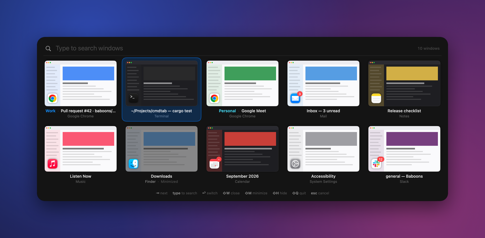
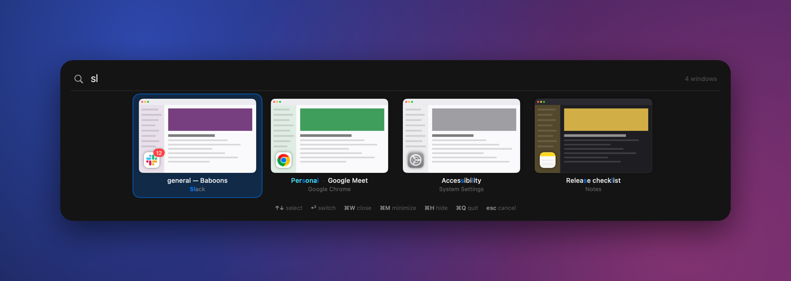
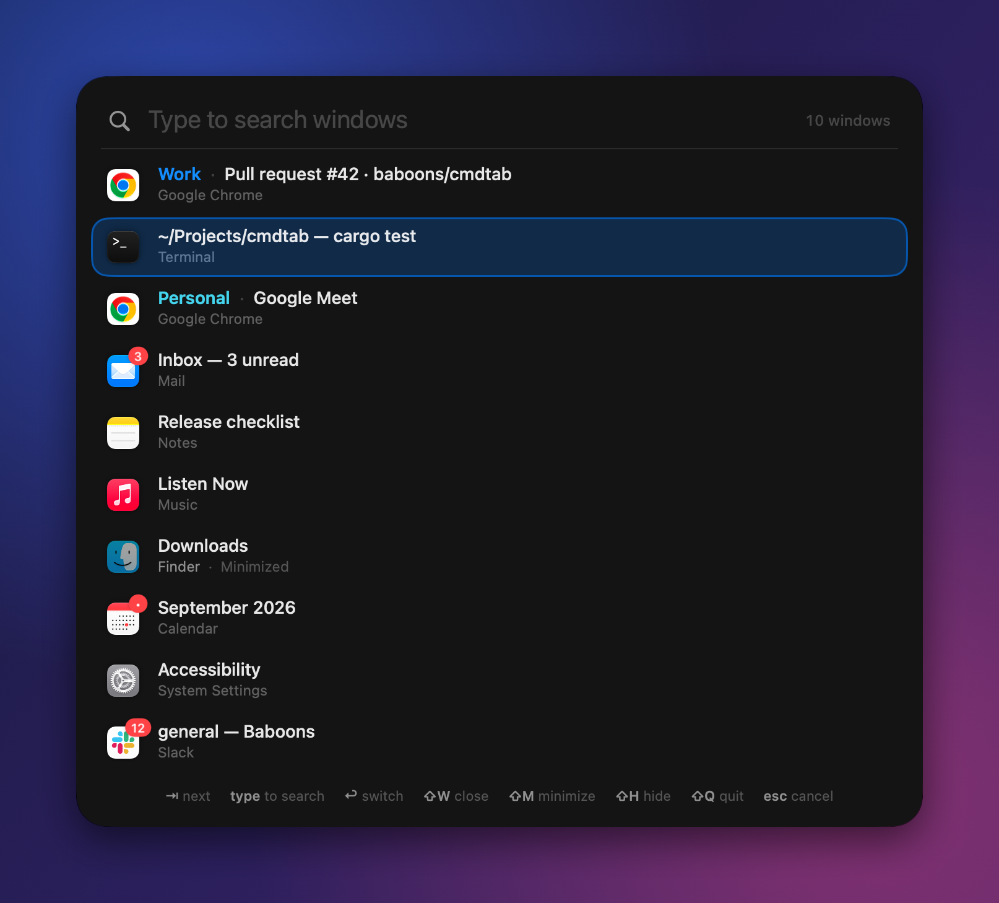

# CmdTab

A fast, elegant ⌘Tab replacement for macOS that switches between **windows** (not just apps), with
**type-to-search** built right into the switcher. Inspired by [AltTab](https://github.com/lwouis/alt-tab-macos).

Native Swift/AppKit shell, Rust search core.



## Install

```sh
brew install --cask baboons/tap/cmdtab
```

Then open CmdTab and grant it **Accessibility** (required) and **Screen Recording** (optional, for window
previews). It lives in the menu bar and updates itself.

You need macOS 14 or later on Apple Silicon.

<details>
<summary>Without Homebrew</summary>

Download `CmdTab-aarch64-apple-darwin.zip` from the [latest release](https://github.com/baboons/cmdtab/releases/latest),
unzip it and move CmdTab.app to /Applications. CmdTab is signed but not notarized, so clear the download
quarantine once before opening it:

```sh
xattr -dr com.apple.quarantine /Applications/CmdTab.app
```
</details>

## Using it

**Press ⌘Tab.** The switcher opens showing every window, with your previous window selected.

- **Type** to filter by app name and window title. The best match is selected.
- **Tab / ⇧Tab / arrows** move the selection, and so do **⌃N / ⌃P** (next / previous), as in any Mac list.
- **↩** switches to the selected window. So does **⌘A**, once you've let go of ⌘ (or if your switcher
  shortcut isn't ⌘Tab); while you're holding ⌘, A just types an "a". **esc** clears the search, or cancels. Clicking outside also closes it.
- **Release ⌘** after moving the selection with Tab, the arrows or ⌃N / ⌃P, and you switch straight to that window. That's the
  classic "hold ⌘, Tab Tab, release" flow. If you only opened it or typed, releasing ⌘ leaves the switcher open
  so you can keep searching.
- **A quick ⌘Tab tap** flips back to your previous window. Anything you release within about 0.3 s without
  pressing another key counts as a tap. A very quick tap doesn't even show the switcher.

Window actions work on the selected window. While ⌘ is held, add ⇧: `⇧W` close · `⇧M` minimize · `⇧H` hide app ·
`⇧Q` quit app · `⇧F` full screen. Once you've let go of ⌘, use `⌘W`, `⌘M`, `⌘H`, `⌘Q`, `⌘F` instead.

Apps show the same unread badges as in the Dock (e.g. Mail's count), read from the Dock through Accessibility.
You can turn them off in Settings.

You can also hover to select, click to switch, and use the × and – buttons on a preview.

**⌥⌘Tab** (configurable) and the menu bar icon open the switcher straight into search.

If you prefer AltTab's classic behaviour, where releasing ⌘ always switches, set *Settings → Releasing ⌘* to
"Switches to the window". You can then still filter by typing while you hold ⌘.

### Search



- Fuzzy matching, fzf-style: `vsc` → **V**isual **S**tudio **C**ode, `gh` → Git**H**ub. Word starts, camelCase
  and runs of consecutive letters score higher.
- Several words are ANDed, and each can match the app or the title: `saf hack` → the Safari window titled
  *Hacker News*.
- Ignores case and accents (`malmo` finds *Malmö*), including decomposed file-name titles.
- **Learns from you.** If you pick Sublime Text after typing `s`, it ranks higher for `s` next time. The counts
  fade over a few weeks. Stored in `~/Library/Application Support/CmdTab/learned.tsv`; you can turn it off or
  reset it in Settings.
- **Browser profiles:** Chrome, Brave, Edge, Vivaldi and other Chromium windows show their profile as a colored
  prefix, and you can search by it (`work meet` finds the Meet window in your work profile). Learned choices are
  kept separately for each profile.
- Ties go to the most recently used window. The window you're already in is ranked a bit lower, because
  when you search you usually want somewhere else.

<p align="center"></p>

### Settings

Switcher shortcut (`⌘Tab`, `⌥Tab` or `⌃Tab`), search shortcut, appear delay, previews vs. compact list,
preview size, an optional clock, which windows to include (minimized, hidden apps, other Spaces, apps without windows),
launch at login.

## Updates

CmdTab checks GitHub for a new release a few times a day. It downloads the update in the background and installs it
when you haven't used the switcher for a minute or two, restarting in about a second. It only installs an update
signed with the same certificate as the running app. You can turn automatic updates off, or check manually, in
Settings or from the menu bar icon. Builds you make yourself never update themselves.

## Building

Requirements: macOS 14+, Rust (stable), and Swift 6 (Xcode *or* just the Command Line Tools).

```sh
make run        # builds core + app into build/CmdTab.app and launches it
make install    # copies it to /Applications
make test       # Rust core tests
```

On first launch CmdTab asks for:

- **Accessibility** (required): to see windows, observe focus changes, and intercept ⌘Tab.
- **Screen Recording** (optional): for live window previews. Without it you get app icons.

macOS ties these grants to the code signature. The Makefile signs with your first code-signing identity
(`security find-identity -p codesigning`) so the grants survive rebuilds. Override it with
`make SIGN_IDENTITY=-` for ad-hoc signing, but then you'll have to grant the permissions again after every
build.

## How it's built

```
core/                     Rust (zero dependencies), static lib with a C ABI
  src/text.rs             case/diacritic folding, char classes, UTF-16 offsets for highlighting
  src/fuzzy.rs            Smith-Waterman-style matcher with affine gaps + boundary bonuses
  src/rank.rs             multi-token, multi-field ranking + recency
  src/learn.rs            decaying query→app memory, persisted by a background writer thread
  include/cmdtab_core.h   the C interface Swift imports
Sources/CmdTab/
  Input/KeyboardTap       CGEventTap on its own high-priority thread
  Windows/WindowStore     live window model fed by AXObservers on a dedicated run-loop thread
  Windows/Thumbnail…      concurrent, cached, downscaled window captures
  Switcher/               session state machine: keys → selection, search, actions
  UI/                     non-activating Liquid Glass panel, hand-laid-out layer-backed cells
```

Where the speed comes from:

- **No work when you press ⌘Tab.** The window list is kept current by Accessibility notifications on a
  background thread. Opening the switcher just renders a snapshot that's already in memory.
- **The key path never waits on the main thread.** The event tap has its own thread and decides on its
  own whether to swallow a key. The UI is updated asynchronously.
- **Search is cheap.** The Rust core takes about 20 µs per keystroke for 50 windows, 40 µs for 200, and
  0.13 ms for 1,000 (`cargo run --release --example bench` in `core/`). It reuses its buffers, so matching
  doesn't allocate.
- **Previews stream in.** Cached thumbnails show immediately. Fresh captures run four at a time off the
  main thread and are downscaled to the size they're displayed at.
- **The panel never takes focus.** It's a non-activating panel, so the app you're leaving isn't disturbed
  until you actually switch.

Like AltTab, CmdTab uses a few private SkyLight/HIServices calls: to focus a specific window across Spaces,
to find windows on other Spaces, to capture windows, and to turn off the system ⌘Tab while CmdTab handles
it. These are resolved at runtime, so if a future macOS drops one, that feature degrades instead of the
app crashing. The system ⌘Tab comes back whenever CmdTab can't handle ⌘Tab itself:
- when you quit or pause CmdTab;
- when it crashes or is force-quit (a small watchdog process handles this);
- while secure input is on, for example in a password field or with Terminal's Secure Keyboard Entry, because macOS
  hides keystrokes from all apps then.

### Releasing

```sh
scripts/release.sh 0.2.0
```

This bumps the version, commits, tags `v0.2.0` and pushes. The Release workflow then builds, signs and publishes
`CmdTab-aarch64-apple-darwin.zip`. Installed copies pick it up on their own, and the Homebrew cask in
[baboons/homebrew-tap](https://github.com/baboons/homebrew-tap) is bumped automatically.

Releases are signed with a dedicated self-signed "CmdTab Release" certificate, stored in the
`CMDTAB_SIGNING_P12` and `CMDTAB_SIGNING_PASSWORD` repository secrets. It must never change. macOS ties the
Accessibility permission to it, and the updater only installs builds signed with it.

### Development

`CmdTab --demo-snapshot out.png [--query sl] [--list] [--dark|--light]` renders the real panel with
sample windows into a PNG. It needs no permissions, so it's handy for UI work.

`open -n build/CmdTab.app --args --ax-dump /tmp/ax.txt com.google.Chrome` writes the Accessibility tree of an
app's windows to a file. It uses CmdTab's own Accessibility permission.

## License

[MIT](LICENSE)
